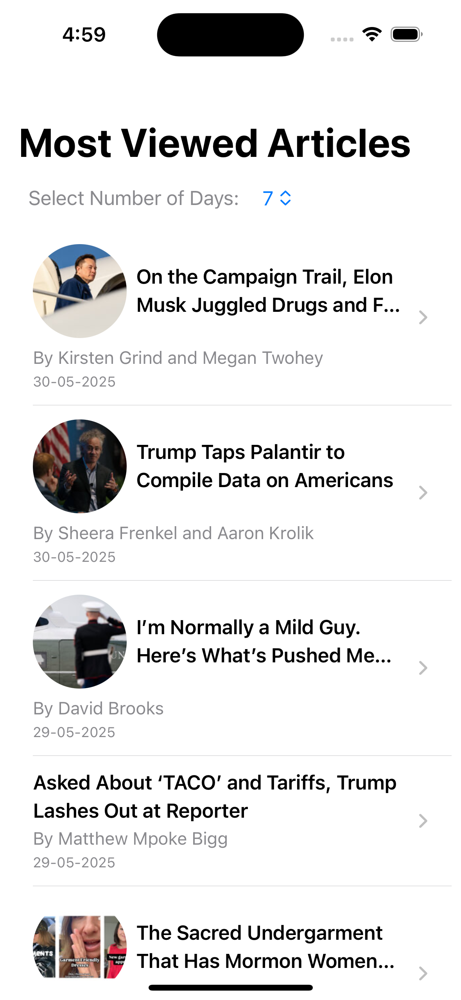
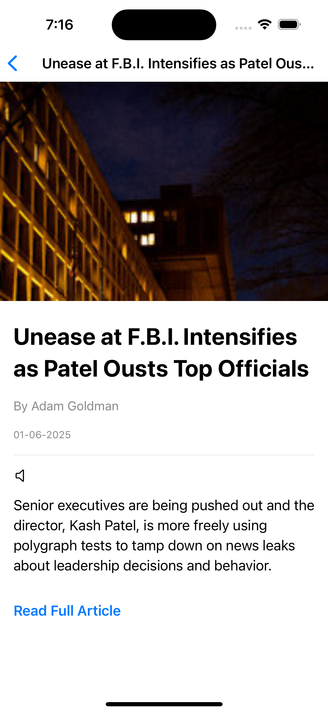
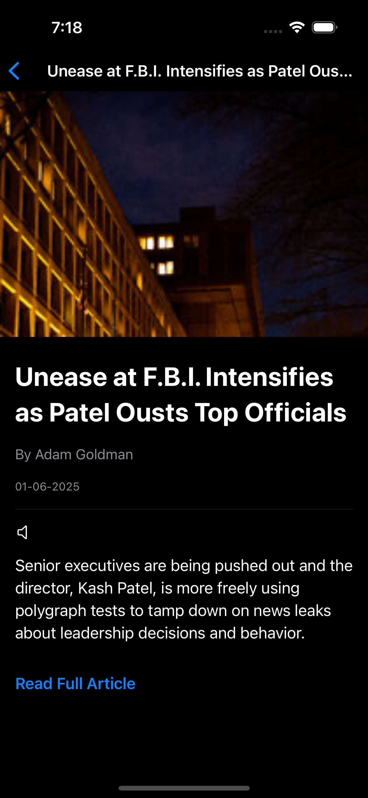

# Features:
  - Fetch most viewed articles on NYTimes.com for specified period of time (1 day, 7 days, or 30 days).
  - Display articles in a list with image, title, author/s, and date.
  - Tap an article to view details.
  - Text-to-speech (TTS) functionality in the article details.
  - Navigate to the website to read the whole articles.
  - Local caching with Realm (the cache is valid for 1 day).
  - Unit tests for core logic.

# Requirements:
  - Xcode Version: 16.3.
  - iOS Deployment Target: +17.0.
  - Swift Version: 5.
  - Swift Package Manager (SPM).

# Architecture:
  - Clean Architecture and MVVM pattern.

# Screenshots:
* Light Mode:
  - List View:
    
    

  - Details View:
  
    

 * Dark Mode:
  - List View:
    
    

  - Details View:
  
    

